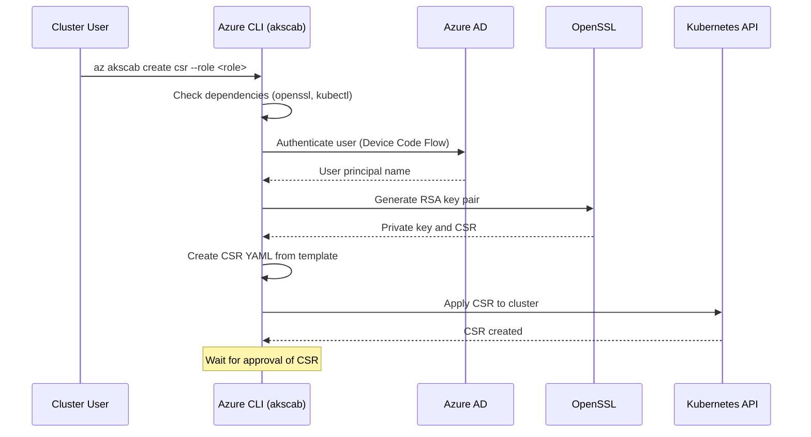

# Azure CLI 'akscab' Extension

The `akscab` extension for Azure CLI enables the creation of Certificate Signing Requests (CSRs) for Azure Kubernetes Service (AKS) clusters in Cluster API Bootstrap (CAB) environments. This extension automates the process of generating RSA keys, creating CSRs, and configuring kubeconfig for authenticated access to AKS clusters.

## Prerequisites

- Azure CLI installed
- `openssl` installed
- `kubectl` installed
- Access to an AKS cluster in a CAB environment
- Azure AD authentication (for production use)

## Installation

Install the extension using Azure CLI:

```bash
az extension add --name akscab
```

Or install from source:

```bash
cd src/akscab
pip install -e .
```

## Usage

### Create a Certificate Signing Request

```bash
az akscab create csr --role <role> [--environment <env>] [--keysize <size>] [--expiration-seconds <secs>] [--dev]
```

#### Parameters

- `--role` (required): The name of the AKS role to use (e.g., `pod-reader`)
- `--environment` (optional): The environment to use (default: `nonprod`)
- `--keysize` (optional): The size of the RSA key to generate (default: `3072`)
- `--expiration-seconds` (optional): The number of seconds the certificate is valid for (default: `1800`)
- `--dev` (optional): Use development mode with minikube instead of Azure AD authentication
- `--kubeconfig-path` (optional): Path to the kubeconfig file (default: `~/.kube/config`)

#### Examples

```bash
# Create CSR for pod-reader role in nonprod environment
az akscab create csr --role pod-reader --environment nonprod

# Create CSR with custom key size and expiration
az akscab create csr --role pod-reader --environment nonprod --keysize 4096 --expiration-seconds 3600

# Create CSR in development mode
az akscab create csr --role pod-reader --environment nonprod --dev
```

### Other Commands

```bash
# List available commands
az akscab list

# Show general help
az akscab help

# Show help for create commands
az akscab create help
```

## How It Works

The `akscab` extension simplifies the process of obtaining certificates for AKS cluster access in CAB environments. Here's a high-level overview of the workflow:



### Detailed Process

1. **Dependency Check**: Verifies that `openssl` and `kubectl` are installed on the system.

2. **User Authentication**: 
   - In production mode: Uses Azure AD Device Code authentication to get the current user's principal name.
   - In development mode (`--dev`): Uses "minikube-user" as the username.

3. **Key Generation**: Uses OpenSSL to generate an RSA key pair with the specified key size (default: 3072 bits).

4. **CSR Creation**: Creates a Certificate Signing Request using a predefined YAML template, substituting the username, role, and other parameters.

5. **CSR Application**: Applies the CSR to the Kubernetes cluster using `kubectl apply`.

6. **Certificate Retrieval** (Future): The CSR needs to be approved by a cluster administrator, after which the signed certificate can be retrieved and used to create a kubeconfig entry.

### Security Considerations

- Private keys are generated locally and never transmitted.
- CSRs are signed by the cluster's Certificate Authority.
- Certificates have configurable expiration times.
- Azure AD authentication ensures only authorized users can request certificates.

## Development

This extension is in preview (`azext.isPreview: true`) and requires Azure CLI core version 2.67.0 or higher.

### Building and Testing

```bash
# Activate virtual environment
source env/bin/activate

# Build the extension
azdev extension build akscab

# Run tests
python -m azdev test --no-exitfirst --discover --verbose azext_akscab

# Lint the code
azdev linter --include-whl-extensions akscab --min-severity medium

# Check style
azdev style akscab
```

## Contributing

Contributions are welcome! Please see the [Azure CLI Extensions repository](https://github.com/Azure/azure-cli-extensions) for contribution guidelines.

## License

This project is licensed under the MIT License - see the [LICENSE](https://github.com/Azure/azure-cli-extensions/blob/master/LICENSE) file for details.